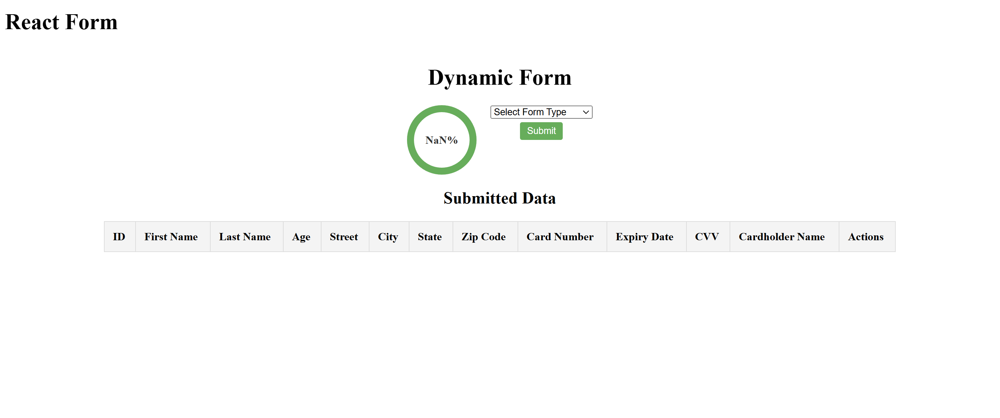

Dynamic Form with React

This project implements a dynamic form using React, where the form fields are generated based on a selected form type. It includes various features such as form validation, dynamic progress bar updates, submission, editing, and resetting form data after submission.

Features:

Dynamic Form Generation: The form fields are generated based on API responses, which are hardcoded for simplicity.
Progress Bar: A progress bar that updates dynamically as the user fills out the form. It indicates the completion percentage of the current section.
Form Validation: Each field is validated based on the backend response. Required fields are checked, and appropriate error messages are displayed.
Submit/Update Functionality: Users can submit a new form or update an existing form entry. The button changes from "Submit" to "Update" when editing an existing entry.
Data Table: After form submission, the data is displayed in a table with options to edit or delete the entries.
Responsive UI: The form layout is responsive, adjusting to both desktop and mobile devices.

